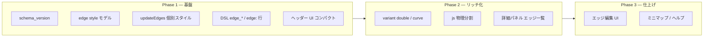

# AI-Canvas ブラッシュアップ項目案（v0.1 草案）

> **v1.0 完成（2026-10-09）**: 運用正本は [RELEASE_v1.md](RELEASE_v1.md)。以下は **v1 以降の候補**。

> **目的**: これまでの運用（サーバーレス・双方向同期・詳細パネル・CLI 正規化）を活かし、**コンパクトな本体**を保ちながら **拡張性・堅牢性・見た目**を上げる。  
> **正本コード**: `Tools/ai-canvas/`（単一 `index.html` + Python 薄層）  
> **起案**: Captain / J.T.（2026-10-09）

### v1 で実装済み（ロードマップから外したもの）

- エッジ Phase 1（`edge_*` / `edges[].style` / CSS 属性）
- 詳細パネル Markdown 表（`CanvasTable`）
- export: シェル + DSL（clone 廃止）、minify `index.export.html`、`build-export`
- inbox / export DSL 埋め込みの堅牢化（JSON / Base64）
- `schema_version: 1`（state）

---

## 0. 設計原則（ブレない線）

| 原則 | 意味 |
|------|------|
| **サーバーレス維持** | ポート・常駐 HTTP は入れない。WebView2 IPC + ファイル同期のまま。 |
| **単一配布面** | キャンバス本体は引き続き **自己完結 HTML + vendor** を正本。ビルド必須にしない（任意で後から esbuild 等）。 |
| **データ駆動** | 見た目の差は **DSL / state / CSS 変数** で表現。ロジックは「型レジストリ + 小さなエンジン」。 |
| **AI フレンドリ** | 座標は Auto-Layout 前提。新属性は **DSL 1 行で説明できる**粒度。 |
| **堅牢性** | 表示前 **CLI `normalize`**、実行時 **同一規則の正規化**、**スキーマ版**で後方互換。 |

---

## 1. 構造上の改善（Captain 案以外の柱）

現状: `index.html` 内に Core・詳細パネル・DSL・全コンポーネントが同居（~1.5k 行）。エッジは `edges[]` が `{ u, v, label }` のみ、スタイルは `.edge-path` 固定。

### 1.1 レイヤ分離（ファイルは増やすが、実行時はコンパクト）

**狙い**: 読み・テスト・差し替えしやすくする。**配布は従来どおり 1 HTML にバンドル可能**（Phase 1 はコメント境界のみでも可）。

```text
ai-canvas/
├── index.html              # シェル + 読込順
├── js/
│   ├── core.js             # Canvas IIFE: objects, edges, layout, sync
│   ├── edge-style.js       # エッジ描画・マーカー・スタイル解決
│   ├── dsl.js              # applyDSL, export DSL
│   ├── detail-markdown.js  # unescape, katex, micro-md
│   ├── bootstrap.js        # pywebviewready, loadFromState
│   └── components/         # card, math, text, svg, table, sticky, group
├── dsl_normalize.py        # 既存
└── canvas_cli.py             # 既存
```

| 段階 | 内容 | リスク |
|------|------|--------|
| **Phase A** | 論理モジュールを `index.html` 内 `// @region core` で区切り、README にマップ | 低 |
| **Phase B** | `js/*.js` に物理分割、`index.html` は `<script src>` 連結（file:// 動作） | 中（読込順） |
| **Phase C** | 任意: リリース用に 1 HTML へインライン化スクリプト | 低 |

### 1.2 スキーマ版（`canvas_state.json` / エッジ）

```json
{
  "schema_version": 1,
  "timestamp": "...",
  "objects": [],
  "edges": []
}
```

- 読込時: 版なし → v0 として扱い、書込時は v1。
- 将来のエッジ属性追加で **旧 state を壊さない**。

### 1.3 エッジを「第一級オブジェクト」に

**現状**: 接続はノードの `to` / `link` から `connect(u,v,label)` で生成。スタイルはグローバル CSS のみ。

**改善**:

```text
edges[i] = {
  id: "e_origin_einstein",   // 任意・自動採番可
  u, v,
  label,
  style: {                    // 省略時はテーマ既定
    stroke: "#38bdf8",
    width: 2.2,
    dash: "6,4",              // なし=実線
    variant: "single"         // single | double | dotted（将来）
  }
}
```

- **DSL**: ノード側 `edge_to="id", edge_color="#...", edge_width=2, edge_dash="4,2"` **または** 独立行  
  `edge: e1 [from="origin", to="einstein", label="定式化", color="#10b981", width=2.5, dash="8,4"]`
- **解決順**: エッジ個別 → ノードの edge_* ヒント → テーマ CSS 変数 `--edge-stroke` 等。
- **`updateEdges()`**: `path` に `stroke` / `stroke-width` / `stroke-dasharray` を **エッジごと** 適用。二重線は `path` 複製 or `filter`（軽量実装は Phase 2）。

### 1.4 DSL / CLI / 表示の三層契約

| 層 | 責務 |
|----|------|
| `dsl_normalize.py` | 投入前の `latex` / `detail`（既存）+ 将来 `edge` 属性の検証 |
| `index.html` | 描画・インタラクション |
| `docs/DATA_AUTHORING.md` | P2 仕様（1 行 `$$`、SVG 等）— README からリンク |

エッジ属性を足すときは **normalize は「未知キーは通す・色は #RRGGBB 検証」** 程度に留め、複雑な検証はオプション。

### 1.5 テストの最小セット（堅牢性）

| 種別 | 内容 |
|------|------|
| **Python** | `test_dsl_normalize.py`（既存）+ エッジ DSL パース（追加） |
| **Node or Python** | ゴールデン: `quantum_demo` → normalize → 代表行スナップショット |
| **GUI smoke** | `smoke_gui_bootstrap.py`（既存）+ エッジ 1 本スタイル付き fixture |

ビルドツールなしでも回せることを維持。

### 1.6 セキュリティ・信頼境界（据え置き＋明文化）

- `innerHTML` / `svg_content` は **自家生成 DSL 前提**。外部 DSL 受付時は将来 `sanitize` 層（オプション）。
- README に trust model を 1 段落。

---

## 2. Captain 案: エッジ属性のリッチ化

### 2.1 属性一覧（段階導入）

| 属性 | DSL / state キー | 描画 | 優先度 |
|------|------------------|------|--------|
| 色 | `color` / `stroke` | `stroke` | **P1** |
| 太さ | `width` | `stroke-width` | **P1** |
| 破線 | `dash`（`"6,4"`） | `stroke-dasharray` | **P1** |
| 矢印 | `arrow`（`true/false`） | `marker-end` | P1 |
| 二重線 | `variant=double` | 2 path オフセット | P2 |
| 曲率 | `curve`（`bezier` 既定 / `orthogonal`） | path 生成 | P2 |
| ラベル位置 | `label_pos` | `text` オフセット | P2 |

### 2.2 UX

- エッジ選択（クリック）→ 詳細パネルに **スタイルプレビュー + 読み取り専用 DSL 片**（将来編集は P3）。
- テーマ切替時は **semantic 色**（`--edge-stroke`）をデフォルト、カスタム色は維持。

### 2.3 AI 向け短い例

```text
math: einstein [latex="E=mc^2", to="origin", link="定式化", edge_color="#10b981", edge_width=2.5, edge_dash="6,3"]
```

---

## 3. Captain 案: UI・UX（ヘッダー・全体）

### 3.1 ヘッダーのコンパクト化

**現状**: ボタン横並び + 長い日本語ラベル + ログバー同一行 → 狭い画面で折り返し・視覚ノイズ。

**案**:

| 施策 | 内容 |
|------|------|
| **アイコン + ツールチップ** | ラベルは `title` / `aria-label`、表示は絵文字または 16px SVG アイコンのみ |
| **ツールバー二段化** | 上: ブランド + 主要 3（整列 LR/TB、Fit、テーマ）／下: ログ 1 行（折り返し可） |
| **「その他 ▾」メニュー** | リセット・単体 HTML 保存・IPC バッジをドロップダウンに |
| **ショートカット表示** | 詳細パネル既存の矢印キーに合わせ、`?` でヘルプオーバーレイ（P2） |

デザイン: 既存 **CSS 変数（Cool / Natural）** を活かし、ボタンは `height: 32px`・`gap: 6px`・幽霊ボタン（透明背景 + hover）。

### 3.2 キャンバス周り

| 項目 | 内容 | 優先度 |
|------|------|--------|
| ミニマップ | 右下 120px 概要（P2・大きいグラフ向け） | P2 |
| ズーム表示 | `100%` インジケータ（任意） | P3 |
| フォーカスリング | 既存選択ハイライトをテーマ連動 | P1 |
| 初回チュートリアル | 3 ステップ toast（選択・矢印・Fit） | P2 |

### 3.3 詳細パネル

- 幅 `min(380px, 90vw)` は維持、**数式ブロックの `overflow-x: auto`**（長い式）。
- タイプバッジ（MATH / CARD）と接続数は既存強み → **エッジ一覧**（リンク先 id をクリックでジャンプ）P2。

---

## 4. その他のブラッシュアップ候補（経験ベース）

| # | 項目 | 理由 | 優先度 |
|---|------|------|--------|
| A | **起動復元の E2E 固定** | ホットリロード事故を再発防止 | 済（bootstrap）→ ドキュメント化のみ |
| B | **エクスポート HTML の DSL 埋め込み** | スナップショットが古いロジックのまま問題 | P1: export 時 normalize 済み DSL |
| C | **コンポーネント登録の型一覧** | AI が未知 type を減らす | `canvas_cli.py types` で一覧 |
| D | **レイアウト preset** | LR/TB に加え `compact` / `presentation` | P2 |
| E | **エッジ・ノードの z-order** | group / sticky の重なり | P2 |
| F | **アクセシビリティ** | `aria` on ツールバー、キーボード Focus 可視 | P2 |
| G | **i18n** | UI 文言を `data-i18n` または小さな辞書 | P3 |
| H | **GitHub / 閉じ役** | Nova 依頼（our-room #31）— リポジトリ分割後 CI で smoke | 運用 |

---

## 5. 推奨ロードマップ（無理のない順）



| Phase | 目安 | 成果物 |
|-------|------|--------|
| **1** | 1〜2 セッション | 色・太さ・破線エッジ、コンパクトヘッダー、`schema_version`、README/DATA 更新 |
| **2** | 見直し | UI（接続一覧・ヘルプ・フォーカス）は採用。**二重線・直交ルートは撤回**（効果/サイズ比）。`edge:` 独立行・export は Phase 1 維持 |
| **3** | 必要時 | インタラクティブ編集、ミニマップ、our-room で三家フィードバック |

---

## 6. あえて「今やらない」（スコープガード）

- React / Vue 化、Cytoscape 等の重量ライブラリ
- リアルタイム共同編集（サーバーが要る）
- キャンバス上の full Markdown エディタ（詳細パネルと役割重複）
- marimo / HTTP サーバー統合（#30 教訓）

---

## 7. 次のアクション（Captain 判断用）

1. **Phase 1 の GO** — エッジ P1 属性 + ヘッダー UI から着手でよいか  
2. **DSL 形式** — ノード `edge_*` のみ先に vs `edge:` 独立行を同時に  
3. **正本ドキュメント** — 本ファイルを our-room #31 にリンクするか  

---

*J.T. — コンパクト本体・拡張はデータとレジストリ・薄いモジュール境界で。見た目は CSS 変数とエッジ個別 style の二層が美しく収まる。*
